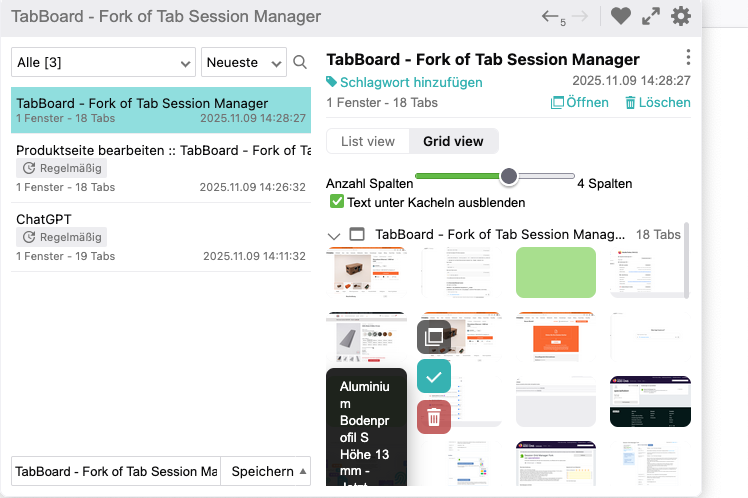
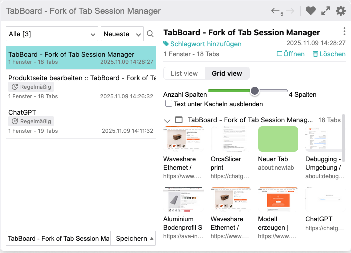
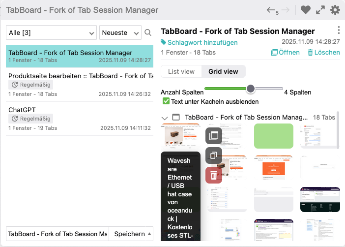

# <sub></sub> TabBoard

### A visual, grid-based session manager for Firefox

Community-maintained fork of [Tab Session Manager](https://github.com/sienori/Tab-Session-Manager) with grid view, screenshot thumbnails, and drag & drop.

---

## Screenshots

<p>
  
  
</p>
<p>
  
</p>

## Features

- **Grid View** — Display saved tabs as visual tiles with screenshot thumbnails
- **Drag & Drop** — Reorder tabs within and between windows
- **Save & Restore** — Save entire sessions or individual windows, with automatic saving support
- **Export / Import** — Transfer sessions between devices
- **Tab Details** — View URL, title, and favicon without opening tabs
- **Adjustable Columns** — Configure the number of grid columns and toggle text labels

## Install

[](https://addons.mozilla.org/firefox/addon/tabboard/)

## Developing

> Requires Node 18+ and npm 10+

1. Clone the repository
   ```
   git clone https://github.com/JustNotesa/TabBoard.git
   ```
2. Create `src/credentials.js`
   ```js
   export const clientId = "xxx"
   export const clientSecret = "xxx"
   ```
3. Install dependencies and start dev mode
   ```
   npm install
   npm run watch-dev
   ```
4. Production build
   ```
   npm run build
   ```

### Load in Firefox

1. Navigate to `about:debugging#/runtime/this-firefox`
2. Click "Load Temporary Add-on" and select any file in `dev/firefox/`

### Load in Chrome

1. Navigate to `chrome://extensions`, enable Developer Mode
2. Click "Load unpacked" and select the `dev/chrome/` folder

## Project Structure

| Path | Description |
|------|-------------|
| `src/popup/` | Popup UI (React) |
| `src/options/` | Settings page (React) |
| `src/background/` | Background scripts |
| `src/_locales/` | Translations |
| `branding/` | TabBoard logo assets |
| `dist/` | Build output (Firefox/Chrome zips) |

## Credits

This project is a fork of [Tab Session Manager](https://github.com/sienori/Tab-Session-Manager) by [sienori](https://github.com/sienori). Thanks to all [backers](https://github.com/sienori/Tab-Session-Manager/blob/master/BACKERS.md) and [translators](https://crowdin.com/project/tab-session-manager) of the original project.

## License

[Mozilla Public License 2.0](LICENSE)
